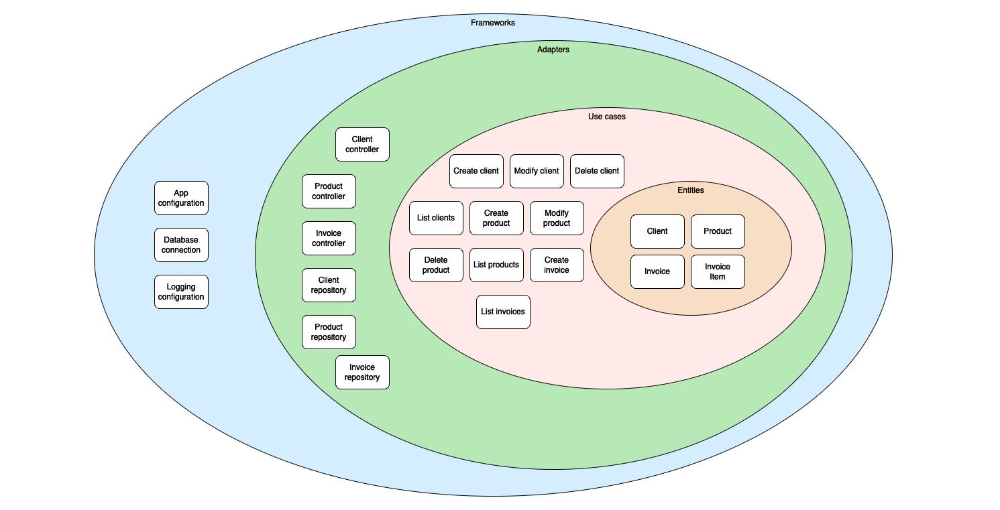

# Payana - Invoice creation system


This is a Node JavaScript application to handle clients, products and invoices.

## Service diagram

The architecture is based on the concept of Clean Architecture, which includes entities, use cases, adapters, and frameworks.



## How to run the application

You can run the app locally with Docker executing

```docker compose up --build ```

This command will:
- Start a PostgreSQL locally in the port 5432
- Make all the migration process through Knex js using the files in /migrations
- Start the payana API locally in the port 3000

## Endpoints

### Product
- GET /products --> List all the products
```
curl --request GET \
  --url http://localhost:3000/products
```

    
- POST /product --> Create a product
```
curl --request POST \
  --url http://localhost:3000/product \
  --header 'Content-Type: application/json' \
  --data '{
	"id": 7,
	"name": "Rodrigo",
	"price": 17
}'
```

- PATCH /product/:id --> Modify a product
```
curl --request PATCH \
  --url http://localhost:3000/product/7 \
  --header 'Content-Type: application/json' \
  --data '{
	"name": "asd",
	"price": 7
}'
```

- DELETE /product/:id --> Delete a product
```
curl --request DELETE \
  --url http://localhost:3000/product/7
```

### Client
- GET /clients --> List all the clients
```
curl --request GET \
  --url http://localhost:3000/clients
```

    
- POST /client --> Create a client
```
curl --request POST \
  --url http://localhost:3000/client \
  --header 'Content-Type: application/json' \
  --data '{
	"id": 4,
	"name": "Diego",
	"email": "diego@diego.com"
}'
```

- PATCH /client/:id --> Modify a client
```
curl --request PATCH \
  --url http://localhost:3000/client/4 \
  --header 'Content-Type: application/json' \
  --data '{
	"name": "Diegui",
	"email": "Diego@diego.com"
}'
```

- DELETE /client/:id --> Delete a client
```
curl --request DELETE \
  --url http://localhost:3000/client/4
```

### Invoice
- GET /invoices --> List all the invoices
```
curl --request GET \
  --url http://localhost:3000/invoices
```

- POST /invoice --> Create a invoice
```
curl --request POST \
  --url http://localhost:3000/invoice \
  --header 'Content-Type: application/json' \
  --data '{
  "client_id": 1,
  "items": [
    {
      "product_id": 1,
      "quantity": 1
    },
		{
			"product_id": 3,
      "quantity": 2
		}
  ]
}'
```
## Testing Strategy

You can run all the tests executing

```npm test```

There are tests that cover all the controllers to ensure the functionality is validated. Instead of connecting to a real database during testing, we use dependency injection to swap in an in-memory database. This decision has been made to obtain a faster execution and minimize the resources that we use.

## Next steps

- Utilize pg-mem or a similar library to create an in-memory PostgreSQL database for more realistic testing scenarios.
- Enhance logging
- Expand test coverage
- Implement soft delete to product and clients to retain tracking data
- Implement a caching for frequently queried data.
- Implement the use of a trace ID to be able to match logs to specific request
- Set up CI/CD pipelines

 
## Questions

* [rnoblega@gmail.com](rnoblega@gmail.com)

